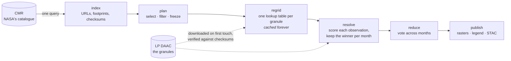

# Stratum in a codespace

You are about to build a **mineral mosaic**: one degree of northern Nevada, assembled from every
EMIT mineral-identification granule acquired over it in 2026, with the monthly results voted into
one map. Nothing has been started for you. Two minutes of context first.

## What a mosaic run is

EMIT sees the same ground many times, from different angles, through different amounts of cloud.
A mosaic has to decide, for every cell on the map, *which observation wins*. Stratum separates
that decision from everything around it:



Three things worth noticing as it runs:

- **The index holds no pixels.** Building it is one catalogue query. Granules are downloaded only
  when a stage first needs one, into `examples/emit-cmr-nevada/out/assets/`, and each file is checked
  against the SHA-512 the catalogue published for it.
- **Regridding is geometry, not science.** It depends only on where the granule's pixels fall on
  the grid, so its result is cached by content and never rebuilt. Change the scoring rule and the
  next run re-reads that cache; only resolve onward re-runs.
- **Every artifact has a key derived from exactly the inputs that determine it.** That is what
  makes the second run take seconds, and what makes an interrupted run resume.

The scoring rule in this demo is the simplest defensible one, *the most nadir look wins*. The
product carries the winning class, an agreement measure (how many months agreed), the support
count, and the band depth of the winning mineral.

## What you need

A free [Earthdata Login](https://urs.earthdata.nasa.gov) account. The walkthrough will ask for it
once and save it to `~/.netrc`, or you can set `EARTHDATA_USERNAME` and `EARTHDATA_PASSWORD` as
[Codespaces secrets](https://github.com/settings/codespaces) and skip the prompt. Stratum never
stores or logs the credential; only the download library reads it.

## Now run it

```
.devcontainer/get-started.sh
```

It takes one step at a time, environment, login, index, plan, run, results, and tells you what
each does before doing it. The full run downloads about 5.6 GB and takes around six minutes on a
four-core codespace; most of that is the download and the geometry. Read `report.md` at the plan
step before spending the bandwidth.

> On a personal GitHub account this fits comfortably inside the free monthly Codespaces
> allowance; delete the codespace when you are done, since storage counts while it exists.
>
> Stopping a codespace terminates running processes but keeps every file. A run interrupted half
> way is normal rather than broken: run the step again and the cache picks up where it stopped.
